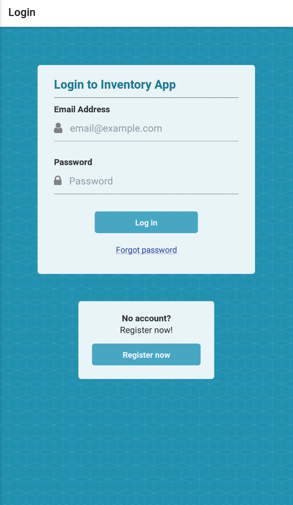
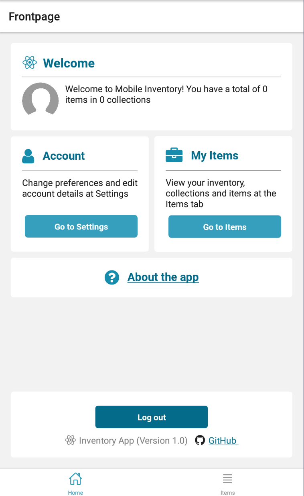
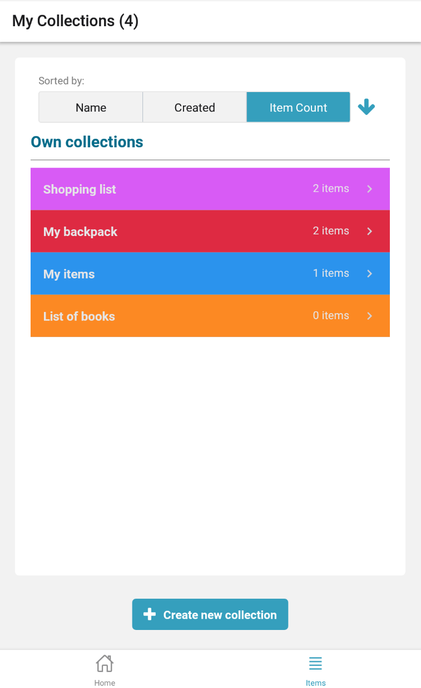
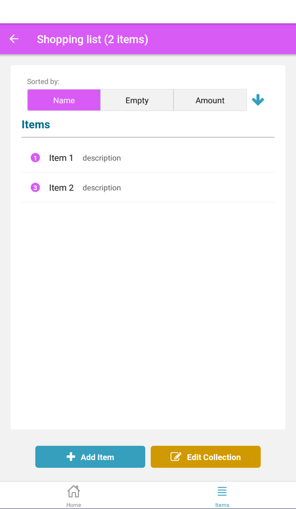
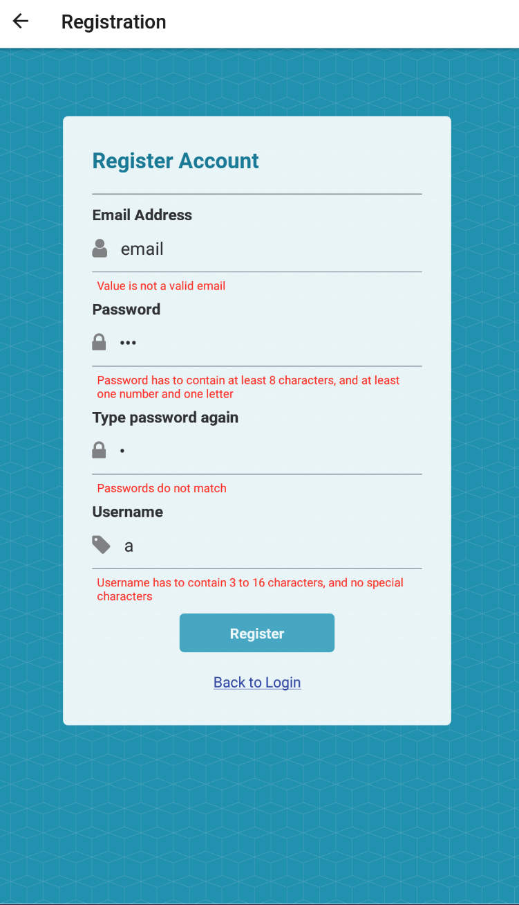

Technologies
- Backend with Firebase Realtime database & Firebase Storage
- Frontend with React Native and expo using:
  - React Navigation
  - React Native Elements
  

Features
  App
  - Styled screens (item listings, frontpage, login/registration, settings screen, loading screen)
  - Dark mode
  - Customized themes

  Items database
  - Add, create, edit and remove item lists (inventories)
  - Sort item lists and items inside them
  - Use phone camera barcode scanner to save/identify items via barcode
  - Create shared inventories which can be seen and edited by people that have access

  Users
  - Register and login
  - Change password inside app or with email
  - Upload profile picture
  - Save and edit user information
  - Access shared inventories with code
  
  Components
  - Custom components:
    - Error-handling and value checking input element
    - Custom buttons with styling
    - Custom dialogs with messages and authentication
    - Colorpicker
    

